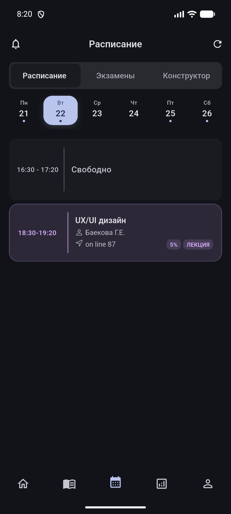
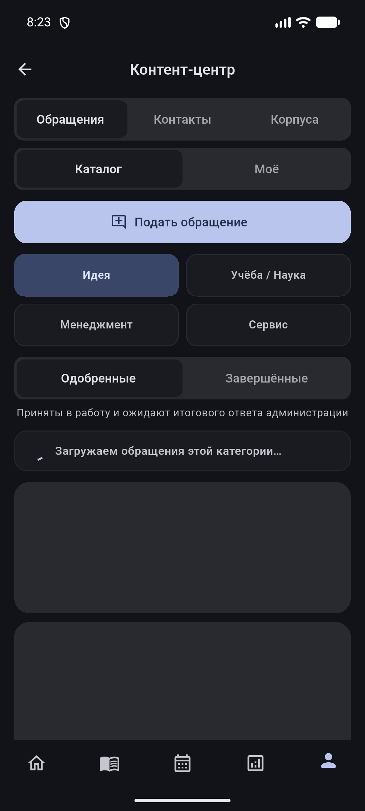
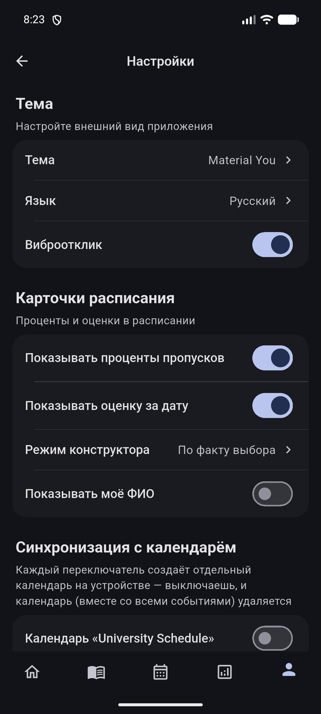

# AppSatbayev

Android release distribution for AppSatbayev, a student companion for Satbayev University.

## Download

Get the current stable build from the [Releases page](https://github.com/nhslo/SatbayevApp-Releases/releases/latest).

Android 7.0 or later is required.

For a manual installation, download `app-release.apk`. It is the universal APK and is the recommended choice for most devices. The release also contains architecture-specific packages for devices or deployment tools that require them:

| File | Intended device |
| --- | --- |
| `app-release.apk` | Universal APK; recommended for manual installation |
| `app-arm64-v8a-release.apk` | Modern 64-bit ARM devices |
| `app-armeabi-v7a-release.apk` | 32-bit ARM devices |
| `app-x86_64-release.apk` | x86_64 emulators and compatible devices |

## Screenshots

  
  
  

## App capabilities

- Current timetable and examination schedule
- Academic journal, attendance and course details
- Attestation results and transcript data
- Student profile, services and academic documents
- Individual study plan and course selection
- Offline-aware data loading, calendar synchronization and Android notifications

## Installation and updates

1. Open the [latest release](https://github.com/nhslo/SatbayevApp-Releases/releases/latest).
2. Download `app-release.apk`.
3. Open the downloaded file and confirm installation in the Android system installer.

The app can also offer the same update from its in-app update flow. Releases are signed with the production certificate, so updates preserve the account session and local application data when the installed package has the same application ID and the incoming Android `versionCode` is higher.

Android intentionally prevents installing an older APK over a newer one. To install a historical release, first remove the current AppSatbayev installation; local application data will be cleared by Android. Then download the required version from the [release history](https://github.com/nhslo/SatbayevApp-Releases/releases) and install its universal APK.

## Repository scope

This repository is the public distribution channel for signed Android APK files and release notes. Application source code, signing credentials and deployment tokens are not stored here. The installed application checks this repository for updates without embedding a GitHub token.

## Release integrity

Only assets attached to a published GitHub Release should be used for installation. Do not install APK files mirrored by third-party sites. Each release contains its own change log, version number and signed APK assets.
