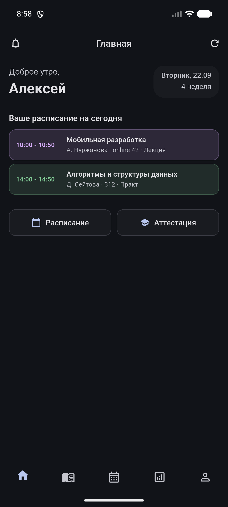
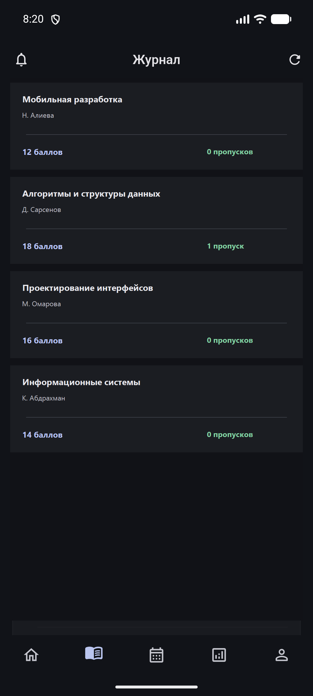
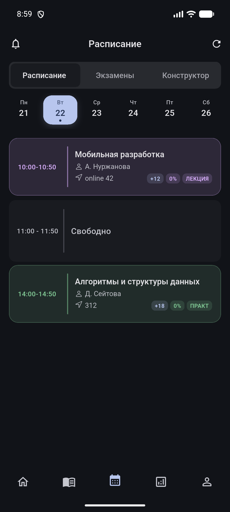
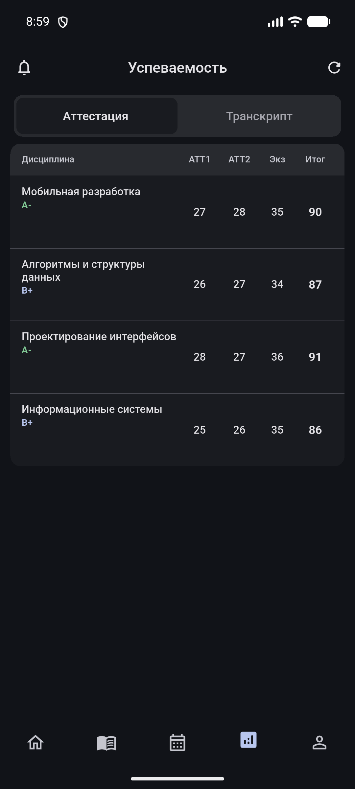
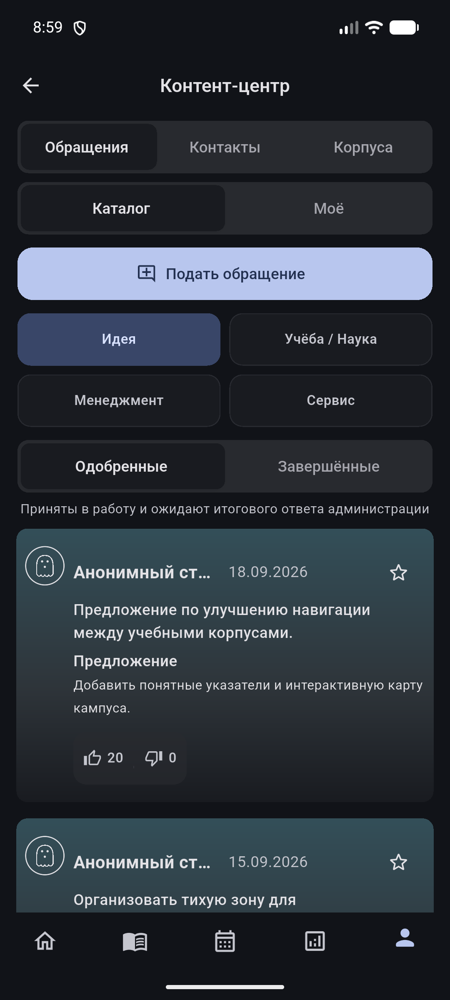
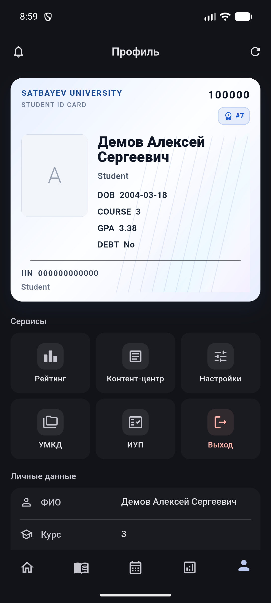

  

<h1 align="center">AppSatbayev</h1>

  Student companion for Satbayev University on Android.

  
  
  
  

---

<h2 align="center">Screenshots</h2>

  
  
  

  
  
  

All account and academic values shown in screenshots are demonstration data.

<h2 align="center">Download</h2>

  Get the app from the <a href="https://github.com/nhslo/SatbayevApp-Releases/releases/latest">latest stable release</a>.

For a manual installation, download `app-release.apk`. It is the universal APK and is the recommended choice for most devices. The release also contains architecture-specific packages for devices or deployment tools that require them:

| File | Intended device |
| --- | --- |
| `app-release.apk` | Universal APK; recommended for manual installation |
| `app-arm64-v8a-release.apk` | Modern 64-bit ARM devices |
| `app-armeabi-v7a-release.apk` | 32-bit ARM devices |
| `app-x86_64-release.apk` | x86_64 emulators and compatible devices |

Copyright &copy; 2026 AppSatbayev. All Rights Reserved. The APK, design, branding, assets, screenshots and documentation may not be copied, modified or redistributed without prior written permission. <a href="LICENSE">License details</a>.

